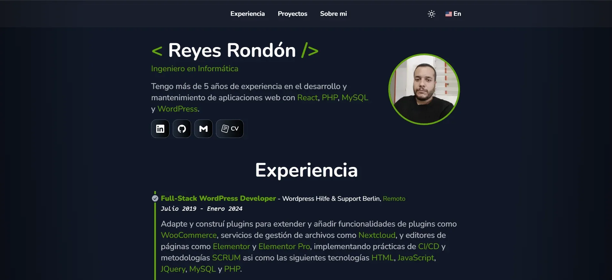

[](https://github.com/Reyes1921/reyesrondon.dev/blob/main/README.md)
[](https://github.com/Reyes1921/reyesrondon.dev/blob/main/README.es.md)

# reyesrondon.dev

Sitio web personal

## 👨‍💻 Tecnologías utilizadas

- [**React 18**](https://react.dev/) - La biblioteca para interfaces de usuario nativas y web.
- [**Next.js 14**](https://nextjs.org/) - El framework de React para la Web.
- [**TypeScript**](https://www.typescriptlang.org/) - TypeScript es un lenguaje de programación fuertemente tipado que se basa en JavaScript.
- [**Tailwindcss**](https://tailwindcss.com/) - Framework de CSS para el diseño de páginas web.
- [**next-intl**](https://next-intl-docs.vercel.app/) - Internacionalización de Next.js
- [**Prettier**](https://prettier.io/) + [prettier-plugin-tailwindcss](https://github.com/tailwindlabs/prettier-plugin-tailwindcss) - Formateador CSS.
- [**atroposjs**](https://atroposjs.com/) - Atropos es una biblioteca JavaScript ligera, gratuita y de código abierto que permite crear impresionantes efectos de paralaje 3D táctiles.
- [**cookies-next**](https://www.npmjs.com/package/cookies-next) - Obtener, establecer y eliminar cookies tanto en el cliente como en el servidor con next.js

## 🚀 Primeros pasos

En primer lugar, ejecute el servidor de desarrollo:

```bash
npm install
npm run dev
```

La aplicación se abre en el puerto 3000


<div align="center">


</div>

# ✉️ Contacto

- Correo electrónico: reyesjrondon@gmail.com
- [Portafolio](https://www.reyesrondon.dev/es)
- [Linkedin](https://www.linkedin.com/in/reyes-rondon/)
