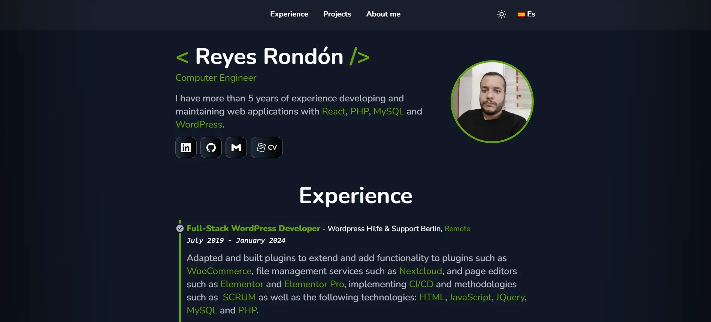

[](https://github.com/Reyes1921/reyesrondon.dev/blob/main/README.md)
[](https://github.com/Reyes1921/reyesrondon.dev/blob/main/README.es.md)

# reyesrondon.dev

Personal web site!

## 👨‍💻 Technologies used

- [**React 18**](https://react.dev/) - The library for web and native user interfaces.
- [**Next.js 14**](https://nextjs.org/) - The React Framework for the Web.
- [**TypeScript**](https://www.typescriptlang.org/) - TypeScript is a strongly typed programming language that builds on JavaScript.
- [**Tailwindcss**](https://tailwindcss.com/) - A utility-first CSS framework.
- [**next-intl**](https://next-intl-docs.vercel.app/) - Internationalization for Next.js
- [**Prettier**](https://prettier.io/) + [prettier-plugin-tailwindcss](https://github.com/tailwindlabs/prettier-plugin-tailwindcss) - CSS formatter.
- [**atroposjs**](https://atroposjs.com/) - Atropos is a lightweight, free and open-source JavaScript library to create stunning touch-friendly 3D parallax hover effects.
- [**cookies-next**](https://www.npmjs.com/package/cookies-next) - Getting, setting and removing cookies on both client and server with next.js

## 🚀 Getting Started

First, run the development server:

```bash
npm install
npm run dev
```

Application opens on port 3000


<div align="center">


</div>

# ✉️ Contact

- E-mail address: reyesjrondon@gmail.com
- [Portfolio](https://www.reyesrondon.dev/en)
- [Linkedin](https://www.linkedin.com/in/reyes-rondon/?locale=en_US)
